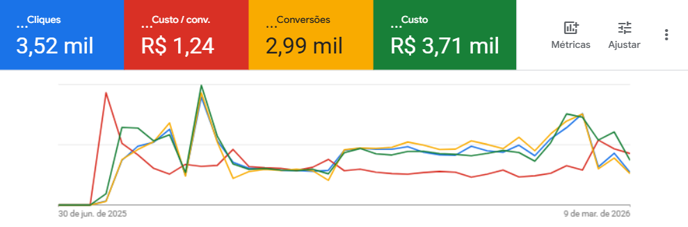
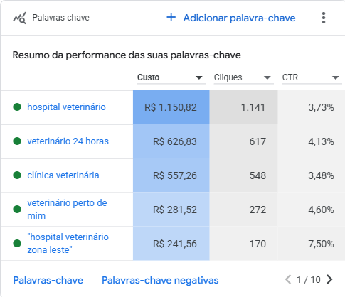
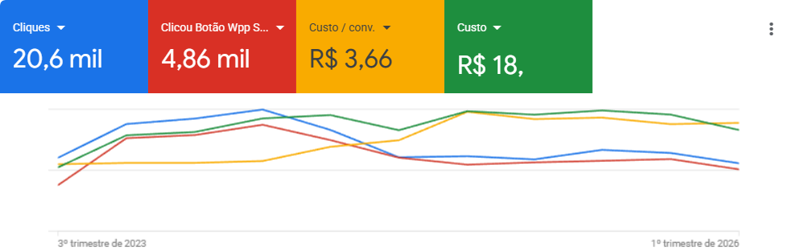
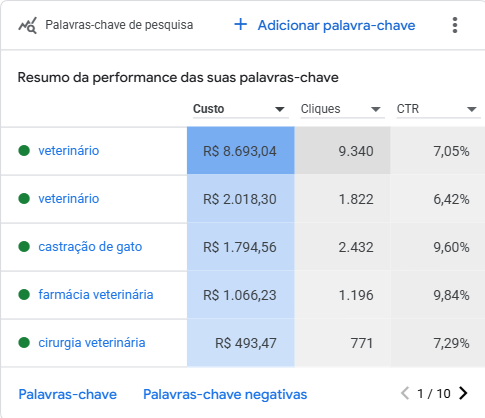

# Copy - Marketing para Veterinários

## Hero
- Credibilidade (linha acima da headline): Mais de 13.000 tutores enviados ao WhatsApp de clínicas veterinárias. Custo médio por contato: R$1,17.
- Headline: Pare de depender de indicações. Preencha a agenda da sua clínica veterinária todos os dias.
- Subheadline: Descubra como um site de alta conversão aliado ao Google Ads pode atrair tutores exatamente no momento em que eles procuram por atendimento para seus pets.
- CTA: Quero lotar minha clínica

## Seção: A Realidade (Storytelling / O Problema)
- Título: Você investiu anos estudando, mas a sala de espera continua vazia em alguns dias?
- Conteúdo: 
  Imagine a cena: É terça-feira à tarde. Sua clínica está impecavelmente limpa, a equipe está a postos e os equipamentos de última geração estão desligados. O telefone não toca.
  
  Você sabe que é um excelente profissional. Seus clientes atuais amam o seu trabalho. Mas depender apenas do "boca a boca" é como tentar encher um balde furado: você não tem controle sobre quando novos pacientes vão chegar.
  
  Enquanto você espera, um tutor desesperado na sua rua acaba de pesquisar "veterinário de emergência urgência perto de mim" no celular. E ele acabou de clicar no anúncio do seu concorrente.

## Seção: A Virada de Chave (A Solução)
- Título: O sistema que os grandes hospitais usam (e que agora está ao seu alcance)
- Conteúdo: 
  A diferença entre a clínica que não tem horário na agenda e a clínica que luta para fechar as contas não é o talento do veterinário. É a presença digital intencional.
  
  Nós criamos uma máquina de previsibilidade: 
  1. Construímos um **Site de Alta Conversão**, desenhado não para ser "bonitinho", mas para ser um imã de contatos no WhatsApp, com carregamento ultrarrápido no celular.
  2. Direcionamos as pessoas certas para ele usando o **Google Ads**, focando em tutores que estão buscando ativamente pelo seu serviço na sua região, agora mesmo.

## Seção: Por que nós (Autoridade / Posicionamento)
- Título: Especialistas em clínicas veterinárias. Não em "marketing digital para tudo".
- Conteúdo:
  Existem dezenas de agências que fazem Google Ads. A maioria atende e-commerce, dentistas, advogados, restaurantes — e encaixa a sua clínica veterinária no mesmo modelo genérico.

  Nós fazemos uma coisa só: colocar tutores no WhatsApp de clínicas veterinárias.

  Isso significa que cada palavra-chave que usamos, cada anúncio que escrevemos e cada ajuste que fazemos parte de um conhecimento acumulado de anos dentro desse nicho específico. Não temos curva de aprendizado às suas custas.

  - **+2 anos** trabalhando exclusivamente com clínicas veterinárias
  - **+15 clínicas** atendidas em todo o Brasil
  - **+13.000 tutores** enviados ao WhatsApp dos nossos clientes
  - **R$1,17** de custo médio por contato gerado no melhor case

## Seção: Nossos Resultados (Cases de Sucesso)
- Título: A prova de que a nossa metodologia funciona
- Conteúdo: Aqui estão os resultados reais das nossas campanhas:

  **Case 1: Aceleração e Escala (Julho/2025 - Março/2026)**
  Em menos de um ano, nossa estratégia de Google Ads aliado a uma Landing Page focada em conversão gerou um crescimento exponencial. Observe o gráfico de cliques e impressões abaixo:
  
  Os números desse período falam por si:
  - **282.330** tutores alcançados no Google
  - **5.010** cliques diretos no WhatsApp da clínica
  - **R$3,67** foi o custo médio para cada tutor que entrou em contato — com orçamento de apenas R$10/dia
  Mais do que quantidade, focamos em **qualidade**. Os contatos gerados não vieram de cliques aleatórios, mas de buscas com altíssima intenção de compra, como "veterinário de emergência", "clínica veterinária 24h" e "veterinário perto".
  

  **Case 2: Consistência a Longo Prazo (Julho/2023 - Março/2026)**
  Uma clínica não vive de "picos de vendas", vive de previsibilidade. Neste case com quase 3 anos de histórico, mantivemos um volume constante de cliques qualificados, garantindo a agenda cheia mês após mês, superando a sazonalidade e desafios de mercado.
  
  Em quase 3 anos de campanha ativa:
  - **255.093** tutores alcançados no Google
  - **8.095** cliques diretos no WhatsApp da clínica
  - **R$1,17** por contato — resultado de uma estratégia cada vez mais afinada ao longo do tempo
  E novamente: o foco incansável em aparecer para quem já quer comprar. Termos precisos que garantem o menor custo por clique e o melhor retorno sobre o investimento (ROI).
  

## Seção: Escolha o seu Pacote
- Título: Escolha o ponto de entrada certo para a sua clínica
- Pacote 1 (Gestão de Anúncios):
  - Nome: Só o Motor
  - Preço: R$950/mês
  - Para quem é: Clínicas que já têm um site rápido e bem construído, e querem começar a receber tutores do Google imediatamente.
  - O que entregamos: Gestão completa das campanhas de Google Ads — pesquisa de palavras-chave, criação dos anúncios, otimização contínua e relatório mensal.
  - CTA: Quero começar com os anúncios

- Pacote 2 (A Máquina Completa):
  - Nome: A Máquina Completa
  - Preço: R$1.950 no 1º mês → R$950/mês a partir do 2º mês
  - Para quem é: Clínicas que não têm site ou têm um site lento e genérico. Entregamos tudo do zero.
  - O que entregamos: Site de alta conversão (projetado para gerar cliques no WhatsApp) + gestão completa do Google Ads + relatório mensal.
  - Destaque: A diferença de R$1.000 no primeiro mês é o site — um ativo que fica com você para sempre.
  - CTA: Quero a solução completa

## FAQ (Perguntas Frequentes)
- Pergunta: "Preciso investir muito no Google Ads?"
  Resposta: Recomendamos um investimento mínimo de apenas R$ 20,00 por dia no Google. Com esse valor já conseguimos aparecer para dezenas de tutores pesquisando ativamente na sua região todos os dias.
- Pergunta: "Vocês atendem clínicas de qual tamanho?"
  Resposta: Atendemos desde o veterinário autônomo que realiza atendimento em domicílio até grandes hospitais veterinários 24 horas.
- Pergunta: "Quanto tempo para ver os primeiros resultados?"
  Resposta: Diferente do Instagram que exige meses de criação de conteúdo, com o Google Ads e nosso site focado em conversão, seu WhatsApp pode começar a receber contatos nos primeiros dias em que a campanha vai ao ar.

## CTA Final
- Título: Assuma o controle da sua agenda hoje
- Conteúdo: Clique no botão abaixo para agendarmos um bate-papo rápido e gratuito. Vamos analisar o potencial da sua clínica e te mostrar o caminho.
- CTA: Falar com um Especialista no WhatsApp
